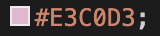

# KOKO Collective
## Code Institute MS4 - Jacob Roos

A live version of the website is available [HERE](https://koko-collective.herokuapp.com/).

Koko Collective is a pet accessories brand selling Dog Collars, Leads, Bandanas and Waste Bag Dispensers.  The business is focussed around using recycled materials and ethical production processes.  The site allows users to purchase items, register and create their own account with order history and delivery address information.  Once a user is logged in they can review products and also add items to a wishlist which can then be transferred to their shopping bag. Admin users have access to "Product Management" which allows the addition of new products and once in the product detail section, these items can be edited or deleted.  The site is very colourful with intuitive navigation and informative feedback via notifications to ensure the best user experience.

# Table of Contents

**

Strategy & Scope
**
* [UX](#ux)
    * [Business Objectives](#business-objectives)
    * [User Objectives](#user-objectives)
    * [User Stories](#user-stories)

**

Structure
**
* [Page Structure](#page-structure)
* [Page Summaries](#page-summaries)
* [Django Apps & Packages](#django-apps-and-packages)
* [Database Design & Structure](#database-design-and-structure)

**

Surface
**
* [Colors](#colours)
* [Fonts](#font-choice)

**

Skeleton
**
* [Wireframes](#wireframes)
* [Final Project Design Differences](#wireframe-and-final-project-differences)
* [Responsive Design](#responsive-design)

**

Features
**

* [Sitewide](#sitewide)
    * [Navbar](#nav-bar)
    * [Banner](#banner)
    * [Footer](#footer)
* [Homepage](#homepage)
* [About](#about)
* [Products](#products)
    * [Product Detail](#product-detail)
    * [Reviews](#reviews)
* [Wishlist](#wishlist)
* [Shopping Bag](#shopping-bag)
* [Checkout](#checkout)
    * [Checkout Success](#checkout-success)
* [Profile](#profile)
* [Product Management](#Product-management)
    * [Add Product](#add-product)
    * [Edit Product](#edit-product)
    * [Authentication](#authentication)
* [Future Features](#future-features)

**

Technologies
**
* [Technologies Used](#technologies-used)

**

Testing
**
- [Testing](#testing)

**

Deployment
**
* [Hosting on Heroku](#hosting-on-heroku)
* [Cloning](#cloning)

**

Credits
**
* [Credits](#credits)
    * [Content](#content)
    * [Media](#media)
- [Acknowledgements](#acknowledgements)
- [Online and Physical](#onlineandphysical)
    * [Websites](#Websites)
    * [Books](#books)

# Strategy and Scope
## UX

### Business Objectives

* The main objective of KOKO collective is to provide a platform that enables the purchase of eco-friendly pet accessories.
* Users should have a friendly, colourful experience with simple navigation and informative feedback.
* The ability to save products to a wishlist for later purchase should also be provided for the customers that might just be browsing.  This then gives more opportunity for targetted marketing based on the users saved items.
* Building confidence in the listed products should also be promoted with a review system where customers can give their personal feedback for other users to view.
* Social Media links will also be added to the footer of the website to allow visitors to easily navigate to the KOKO Collective channels.

### User Objectives

* Users would be on the site to purchase items and to explore the brand ethos to compare to competitors.
* Users would want to be able to read more about the company and its manufacturing processes and materials used to justify their eco-friendly purchase.
* Users might also want to create a profile that saves delivery information and order history.
* Users might also want leave reviews on products they've purchased to help support the brand and it's ethos.

## User Stories

### Viewing and Navigation:
| ID | As a... | I want to be able to... | So that I can... |
|----|:--------|:------------------------|:-----------------|
1| Shopper| View a list of products available | Browse and select items to purchase |
2| Shopper | View individual product details | View extra images and product information |
3| Shopper | Easily see featured items and promotions | Take advantage of savings and newest products |
4| Shopper | Easily view the total of my shopping bag | Avoid spending to much and stay within my budget |
5| Shopper | See reviews and an average rating of each product | Better judge my purchase based on product feedback |

### Registration and User Accounts
| ID | As a... | I want to be able to... | So that I can... |
|----|:--------|:------------------------|:-----------------|
6| Site User | Easily register for an account | Have personal account and view my information |
7| Site User | Easily Login or Logout | Access my profile and wishlist information |
8| Site User | Easily Recover my password incase I forget it | Recover access to my account |
9| Site User | Receive an email confirmation after registering | Verify my registration was a success |
10| Site User | Have a personalized user profile | View my order history and Update my payment information |

### Registered User Extra Functionality
| ID | As a... | I want to be able to... | So that I can... |
|----|:--------|:------------------------|:-----------------|
11| Registered User | Add my own review for a product | Inform other users to the quality of the product |
12| Registered User | Edit/Update my review | Correct any potential mistakes or a change of opinion |
13| Registered User | Delete my review | Remove it from the site if I feel it's no longer relevant |
14| Registered User | Add products to my wishlist | View them at a later date |
15| Registered User | Transfer items from my wishlist to my shopping bag | Quickly purchase the items I saved in my wishlist |
16| Registered User | Remove items from my wishlist | Keep only the items I'm currently interested saved and remove others I'm no longer interested in |
17| Registered User | Clear out my wishlist | Quickly give myself a clean slate to add new items to instead of removing items individually |

### Sorting and Searching
| ID | As a... | I want to be able to... | So that I can... |
|----|:--------|:------------------------|:-----------------|
18| Shopper | Sort the list of available products | Easily find the products I want, by price, category or rating |
19| Shopper | Sort a specific category of products | Find the best priced or rated products in a specific category or sort them by name |
20| Shopper | Search for a product by name or description | Find a specific product I'd like to purchase |
21| Shopper | Easily see my search query and the number of results | To quickly be able to decide if the product I want is available |

### Purchasing and Checkout
| ID | As a... | I want to be able to... | So that I can... |
|----|:--------|:------------------------|:-----------------|
22| Shopper | Easily select the size and quantity of a product when purchasing | Ensure I don't accidently selected the wrong amount or size |
23| Shopper | View items in my bag to be purchased | Identify the total cost of my purchase and all the items I will receive |
24| Shopper | Adjust the quantity of individual items in my bag | Easily make changes to my purchase before checkout |
25| Shopper | Easily enter my payment information | Checkout quickly with no hassles |
26| Shopper | Feel my personal and payment information is safe and secure | Confidently provide the needed information to make a purchase |
27| Shopper | View an order confirmation after checkout | Verify that I haven't made any mistakes |
28| Shopper | Recieve an email after checkout with my order details | Keep the confirmation of what I've purchased for my records |

### Admin and Store Management
| ID | As a... | I want to be able to... | So that I can... |
|----|:--------|:------------------------|:-----------------|
29| Store Owner | Add a product | Add new products to my store |
30| Store Owner | Edit and update a product | Change product prices, descriptions, images etc. |
31| Store Owner | Delete a product | Remove items that are no longer for sale |

# Structure

### Page Structure

* The site has a conventional layout that has many uniform elements that are re-used to create a strong identity. Portions of the site design were coded from the ground up, but some elements were inspired by the Code Institute 'Boutique-Ado' mini-project.

* The structure and theme were also inspired by doing extensive market research within the pet accessories industry.  Notes were made on features and layouts that had the best UX, with some of these being reflected in the KOKO collective site. 

* ### The following pages were decided upon:
    * Home Page
    * About
    * Products (which filters in the navbar)
    * Edit Product
    * Add Product
    * Product Detail (which includes the reviews)
    * Profile
    * Wishlist
    * Shopping Bag
    * Checkout
    * Checkout Success
    * Authentication Pages (Allauth Templates)

* ### The Navbar has the following links:
    * Home
    * About
    * Shop
        * All Products
        * Dog Collars
        * Dog Leads
        * Dog Bandanas
        * Waste Bag Dispensers
    * My Account (Not Logged in/Registered)
        * Login
        * Register
    * My Account (Logged in)
        * Product Management (Superuser only)
        * My Profile
        * Wishlist
        * Logout
        * Shopping Bag (Bag Icon)

## Page Summaries

### Home Page

* The home page will have a colourful hero-image with the brand motto and a shop now button. 
* Below this will be a small section giving a larger summary of what the products are made of and brand ethos.
* Underneath this will be a 3 row section containing key information, some more imagery and testimonials (in that order).
* Following this will be a section of featured items with a view all button underneath.
* Next will be a 3 column, card layout with images. Each image will have a button attached which filters the products accordingly and takes the user to the products page.
* The last section before the footer will have a simple banner style image that has some text and a find out more button which navigates to the about page.

### About

* The about page will have information on the business manufacturing processes and ethical practises.  The layout will consist of 3 sections containing text and an image.

### Products (which filters in the navbar)

* The products page will dynamically show products from the database which can then be filtered.

### Add Product

* This page will contain a simple form where the admin user can enter all relevant information and upload images for a new product.

### Edit Product

* The edit product page will contain the same form as the add product page but will also display the current product images which can be updated.

### Product Detail (which includes the reviews)

* The product detail page will display all the extended information for a specific product.  Here the admin user will be able to either edit or delete the product.  Users will also be able to either add the product to their shopping bag or wishlist (if logged in)

### Profile

* The profile page will have the users saved delivery information or will be a blank form that can be updated and saved for future purchases.  The user order history will also be displayed.

### Wishlist

* This page is similar to the shopping bag but with some extra icons allowing the user to either delete an item from the list or add it to their bag.  There will also be a button to clear the wishlist altogether.

### Shopping Bag

* The shopping bag will have a table layout but also include a dynamic subtotal.  Users will be able to remove and update quantities for items in their bag.

### Checkout

* This page will have 2 sections. Firstly the delivery information which will be populated with the user's saved information or empty if there isn't any information in the database. The other section will have a short order summary.

### Checkout Success

* The checkout success will thank the user for their purchase and show a details order summary.

### Authentication Pages (Allauth Templates)

* The authentication pages (login, logout, register etc.) are all templates provided by allauth and have been styled to suite the theme of the overall site.

## Django Apps and Packages

### Koko Collective consists of 7 apps that contain all the site features
* home
* products
* profiles
* reviews
* wishlist
* checkout
* bag

### Other Django packages included are:
* crispy_forms
* storages
* allauth

## Database Design and Structure

# Surface

## Colours
### The site consists of 3 main colours:

* Other elements use the built in Bootstrap classes.  For example the messages box arrow colour is based on the nature of the information being displayed.
* The site also uses black and white for text and certain icons.

## Fonts

### The following fonts were used accross the site:
* Roboto @ 100 and 400 weights.
    * I decided on Roboto as it was similar to the logo font and has a modern look.
* Sans Serif as default backup.

# Skeleton

## Wireframes

## Wireframe and Final Project Differences

## Responsive Page Design

### Across the site Bootstrap 4 classes were used to make the site responsive.  Other elements and viewport changes are reflected in the project base.css media queries.

* Header
    * The site header has added classes to change the order of the items within to allow for a better mobile experience.  For tablets and larger screens the hamburger is to the left, logo central, and account/bag icons to the right.  For mobiles the logo is placed to the left, hamburger to the right and account/bag icons centered underneath.

* Home Page

    * The homepage has classes added so the columns are full width and the sections stack.  I've also made the choice to not display the image that's to the right of the brand summary section for mobiles.  I feel this improves the look and doesn't clutter the UX with too many images while scrolling. For tablets the only change is the featured items reducing to 2 items per row instead of 3.

* About

    * The about page has 3 rows that stack for mobile devices.  The second section also has classes added to change the order to match the 1st and 3rd section.

* Products (which filters in the navbar)

    * The products page has a simple system where there are 3 products per row for large devices, 2 for tablets and 1 for mobile devices.

* Add Product

    * The form on this page covers 50% of the vieport width for large devices and tablets. For mobiles the form extends to the full width.

* Edit Product

    * The form on this page covers 50% of the vieport width for large devices and tablets. For mobiles the form extends to the full width. The current additional images are arranged as 3 items per row, this converts to full width for mobile devices.

* Product Detail (which includes the reviews)

    * The product detail page has 2 column format that changes to a full width layout for mobile devices. Reviews are shown as 2 per row before adding another row with all odd number reviews being aligned in the center.

* Profile

    * The profile page has a 2 column layout for larger devices which stacks and goes full width for tablets and mobile devices.

* Wishlist

    * This page has a 1 column row layout for large devices.  The layout for tablets changes to a 2 column layout with the product image on the left and all other options on the right. For mobile devices all sections stack with the product image a the top.

* Shopping Bag

    * The shopping bag has a single row layout for each product and another for the costs and buttons underneath. This is the same for tablets as well. For mobile devices the information stacks but the order costs and buttons are now stacked ontop of the product image, followed by the product information.

* Checkout

    * The checkout page has a 2 column layout with the delivery information on the left and order summary on the right. This changes to a stacked layout with the order summary ontop.

* Checkout Success

    * The checkout success page has a 50% width column aligned left for larger devices which contains the order information.  For tablets and mobile devices this extends to a full width container.

* Authentication Pages (Allauth Templates)

    * The authentication pages (login, logout, register etc.) all have their forms aligned to the left in a 50% width column. This extends to full width for mobile devices.

* Footer

    * The layout of the footer remains the same for all devices, with all the social icons and copyright centered.

# Features

### Sitewide

### Navbar

### Banner

### Footer

### Homepage

### About

### Products

### Product Detail

### Reviews

### Wishlist

### Shopping Bag

### Checkout

### Checkout Success

### Profile

### Product Management

### Add Product

### Edit Product

### Authentication

### Future Features

# Technologies Used

### Languages

### Libraries

### Tools

### Database

### Payment Handling

# Testing

# Deployment

### Gitpod

### Hosting on Heroku

### Hosting Files using AWS

### Cloning

# Credits

### Content

### Media

#### Images

### Acknowledgements

### Online and Physical

### Websites

### Books
