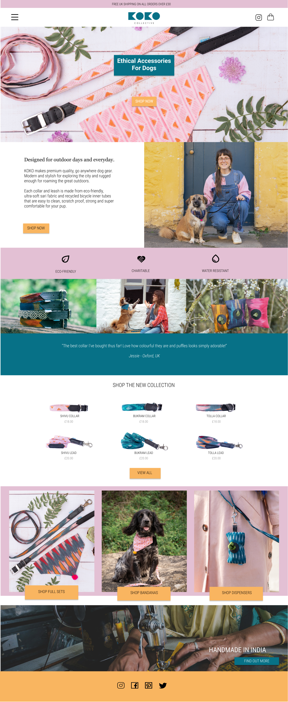

# KOKO Collective
## Code Institute MS4 - Jacob Roos

<hr>


A live version of the website is available [HERE](https://koko-collective.herokuapp.com/).

Koko Collective is a pet accessories brand selling Dog Collars, Leads, Bandanas and Waste Bag Dispensers.  The business is focussed around using recycled materials and ethical production processes.  The site allows users to purchase items, register and create their own account with order history and delivery address information.  Once a user is logged in they can review products and also add items to a wishlist which can then be transferred to their shopping bag. Admin users have access to "Product Management" which allows the addition of new products and once in the product detail section, these items can be edited or deleted.  The site is very colourful with intuitive navigation and informative feedback via notifications to ensure the best user experience.


# Table of Contents

**<details><summary>Strategy & Scope</summary>**
* [UX](#ux)
    * [Business Objectives](#business-objectives)
    * [User Objectives](#user-objectives)
    * [User Stories](#user-stories)
</details>

**<details><summary>Structure</summary>**
* [Page Structure](#page-structure)
* [Page Summaries](#page-summaries)
* [Django Apps & Packages](#django-apps-and-packages)
* [Database Design & Structure](#database-design-and-structure)

</details>

**<details><summary>Surface</summary>**
* [Colors](#colours)
* [Fonts](#font-choice)

</details>

**<details><summary>Skeleton</summary>**
* [Wireframes](#wireframes)
* [Final Project Design Differences](#wireframe-and-final-project-differences)
* [Responsive Design](#responsive-design)

</details>

**<details><summary>Features</summary>**

* [Navbar](#nav-bar)
* [Banner](#banner)
* [Footer](#footer)
* [Homepage](#homepage)
* [About](#about)
* [Products](#products)
* [Product Detail](#product-detail)
* [Reviews](#reviews)
* [Wishlist](#wishlist)
* [Shopping Bag](#shopping-bag)
* [Checkout](#checkout)
* [Checkout Success](#checkout-success)
* [Profile](#profile)
* [Add Product](#add-product)
* [Edit Product](#edit-product)
* [Authentication](#authentication)
* [Future Features](#future-features)

</details>

**<details><summary>Technologies</summary>**
* [Technologies Used](#technologies-used)
</details>

**<details><summary>Testing</summary>**
- [Testing](#testing)
</details>

**<details><summary>Deployment</summary>**
* [Hosting on Heroku](#hosting-on-heroku)
* [Cloning](#cloning)
</details>

**<details><summary>Credits</summary>**
* [Credits](#credits)
    * [Content](#content)
    * [Media](#media)
- [Acknowledgements](#acknowledgements)
- [Online and Physical](#onlineandphysical)
    * [Websites](#Websites)
    * [Books](#books)

</details>

<br>

# Strategy and Scope
## UX
<hr>

### Business Objectives

* The main objective of KOKO collective is to provide a platform that enables the purchase of eco-friendly pet accessories.
* Users should have a friendly, colourful experience with simple navigation and informative feedback.
* The ability to save products to a wishlist for later purchase should also be provided for the customers that might just be browsing.  This then gives more opportunity for targetted marketing based on the users saved items.
* Building confidence in the listed products should also be promoted with a review system where customers can give their personal feedback for other users to view.
* Social Media links will also be added to the footer of the website to allow visitors to easily navigate to the KOKO Collective channels.

### User Objectives

* Users would be on the site to purchase items and to explore the brand ethos to compare to competitors.
* Users would want to be able to read more about the company and its manufacturing processes and materials used to justify their eco-friendly purchase.
* Users might also want to create a profile that saves delivery information and order history.
* Users might also want leave reviews on products they've purchased to help support the brand and it's ethos.

[Back to top](#table-of-contents)
## User Stories
<hr>

### Viewing and Navigation:
| ID | As a... | I want to be able to... | So that I can... |
|----|:--------|:------------------------|:-----------------|
1| Shopper| View a list of products available | Browse and select items to purchase |
2| Shopper | View individual product details | View extra images and product information |
3| Shopper | Easily see featured items and promotions | Take advantage of savings and newest products |
4| Shopper | Easily view the total of my shopping bag | Avoid spending to much and stay within my budget |
5| Shopper | See reviews and an average rating of each product | Better judge my purchase based on product feedback |

### Registration and User Accounts
| ID | As a... | I want to be able to... | So that I can... |
|----|:--------|:------------------------|:-----------------|
6| Site User | Easily register for an account | Have personal account and view my information |
7| Site User | Easily Login or Logout | Access my profile and wishlist information |
8| Site User | Easily Recover my password incase I forget it | Recover access to my account |
9| Site User | Receive an email confirmation after registering | Verify my registration was a success |
10| Site User | Have a personalized user profile | View my order history and Update my payment information |

### Registered User Extra Functionality
| ID | As a... | I want to be able to... | So that I can... |
|----|:--------|:------------------------|:-----------------|
11| Registered User | Add my own review for a product | Inform other users to the quality of the product |
12| Registered User | Edit/Update my review | Correct any potential mistakes or a change of opinion |
13| Registered User | Delete my review | Remove it from the site if I feel it's no longer relevant |
14| Registered User | Add products to my wishlist | View them at a later date |
15| Registered User | Transfer items from my wishlist to my shopping bag | Quickly purchase the items I saved in my wishlist |
16| Registered User | Remove items from my wishlist | Keep only the items I'm currently interested saved and remove others I'm no longer interested in |
17| Registered User | Clear out my wishlist | Quickly give myself a clean slate to add new items to instead of removing items individually |

### Sorting and Searching
| ID | As a... | I want to be able to... | So that I can... |
|----|:--------|:------------------------|:-----------------|
18| Shopper | Sort the list of available products | Easily find the products I want, by price, category or rating |
19| Shopper | Sort a specific category of products | Find the best priced or rated products in a specific category or sort them by name |
20| Shopper | Search for a product by name or description | Find a specific product I'd like to purchase |
21| Shopper | Easily see my search query and the number of results | To quickly be able to decide if the product I want is available |

### Purchasing and Checkout
| ID | As a... | I want to be able to... | So that I can... |
|----|:--------|:------------------------|:-----------------|
22| Shopper | Easily select the size and quantity of a product when purchasing | Ensure I don't accidently selected the wrong amount or size |
23| Shopper | View items in my bag to be purchased | Identify the total cost of my purchase and all the items I will receive |
24| Shopper | Adjust the quantity of individual items in my bag | Easily make changes to my purchase before checkout |
25| Shopper | Easily enter my payment information | Checkout quickly with no hassles |
26| Shopper | Feel my personal and payment information is safe and secure | Confidently provide the needed information to make a purchase |
27| Shopper | View an order confirmation after checkout | Verify that I haven't made any mistakes |
28| Shopper | Recieve an email after checkout with my order details | Keep the confirmation of what I've purchased for my records |

### Admin and Store Management
| ID | As a... | I want to be able to... | So that I can... |
|----|:--------|:------------------------|:-----------------|
29| Store Owner | Add a product | Add new products to my store |
30| Store Owner | Edit and update a product | Change product prices, descriptions, images etc. |
31| Store Owner | Delete a product | Remove items that are no longer for sale |

[Back to top](#table-of-contents)
# Structure

### Page Structure

* The site has a conventional layout that has many uniform elements that are re-used to create a strong identity. Portions of the site design were coded from the ground up, but some elements were inspired by the Code Institute 'Boutique-Ado' mini-project.

* The structure and theme were also inspired by doing extensive market research within the pet accessories industry.  Notes were made on features and layouts that had the best UX, with some of these being reflected in the KOKO collective site. 

* ### The following pages were decided upon:
    * Home Page
    * About
    * Products (which filters in the navbar)
    * Edit Product
    * Add Product
    * Product Detail (which includes the reviews)
    * Profile
    * Wishlist
    * Shopping Bag
    * Checkout
    * Checkout Success
    * Authentication Pages (Allauth Templates)
<hr>

* ### The Navbar has the following links:
    * Home
    * About
    * Shop
        * All Products
        * Dog Collars
        * Dog Leads
        * Dog Bandanas
        * Waste Bag Dispensers
    * My Account (Not Logged in/Registered)
        * Login
        * Register
    * My Account (Logged in)
        * Product Management (Superuser only)
        * My Profile
        * Wishlist
        * Logout
        * Shopping Bag (Bag Icon)

[Back to top](#table-of-contents)
## Page Summaries
<hr>

### Home Page

* The home page will have a colourful hero-image with the brand motto and a shop now button. 
* Below this will be a small section giving a larger summary of what the products are made of and brand ethos.
* Underneath this will be a 3 row section containing key information, some more imagery and testimonials (in that order).
* Following this will be a section of featured items with a view all button underneath.
* Next will be a 3 column, card layout with images. Each image will have a button attached which filters the products accordingly and takes the user to the products page.
* The last section before the footer will have a simple banner style image that has some text and a find out more button which navigates to the about page.

### About

* The about page will have information on the business manufacturing processes and ethical practises.  The layout will consist of 3 sections containing text and an image.

### Products (which filters in the navbar)

* The products page will dynamically show products from the database which can then be filtered.

### Add Product

* This page will contain a simple form where the admin user can enter all relevant information and upload images for a new product.

### Edit Product

* The edit product page will contain the same form as the add product page but will also display the current product images which can be updated.

### Product Detail (which includes the reviews)

* The product detail page will display all the extended information for a specific product.  Here the admin user will be able to either edit or delete the product.  Users will also be able to either add the product to their shopping bag or wishlist (if logged in)

### Profile

* The profile page will have the users saved delivery information or will be a blank form that can be updated and saved for future purchases.  The user order history will also be displayed.

### Wishlist

* This page is similar to the shopping bag but with some extra icons allowing the user to either delete an item from the list or add it to their bag.  There will also be a button to clear the wishlist altogether.

### Shopping Bag

* The shopping bag will have a table layout but also include a dynamic subtotal.  Users will be able to remove and update quantities for items in their bag.

### Checkout

* This page will have 2 sections. Firstly the delivery information which will be populated with the user's saved information or empty if there isn't any information in the database. The other section will have a short order summary.

### Checkout Success

* The checkout success will thank the user for their purchase and show a details order summary.

### Authentication Pages (Allauth Templates)

* The authentication pages (login, logout, register etc.) are all templates provided by allauth and have been styled to suite the theme of the overall site.

[Back to top](#table-of-contents)
## Django Apps and Packages
<hr>

### Koko Collective consists of 7 apps that contain all the site features
* home
* products
* profiles
* reviews
* wishlist
* checkout
* bag

### Other Django packages included are:
* crispy_forms
* storages
* allauth

# Database Design and Structure

### The database structure consists of 8 models across 7 apps
### The apps with database information are listed below.

* Products App
    * This app contains 3 models to handle product information, categories and images:
```bash
class Product(models.Model):
    category = models.ForeignKey('Category', null=True, blank=True,
                                 on_delete=models.SET_NULL)
    sku = models.CharField(max_length=254, null=True, blank=True)
    name = models.CharField(max_length=254)
    description = models.TextField()
    has_sizes = models.BooleanField(default=False, null=True, blank=True)
    price = models.DecimalField(max_digits=12, decimal_places=2)
    avg_rating = models.DecimalField('average rating', max_digits=2,
                                     decimal_places=1, default=0,
                                     null=True, blank=True)
    is_featured = models.BooleanField(default=False, null=True, blank=True)
    main_image = models.ImageField(null=True, blank=True)
```
``` bash
    class Category(models.Model):

    class Meta:
        verbose_name_plural = 'Categories'

    name = models.CharField(max_length=254)
    friendly_name = models.CharField(max_length=254, null=True, blank=True)
```
``` bash
    class ProductImage(models.Model):
    product = models.ForeignKey(
        Product, on_delete=models.CASCADE, related_name='images')
    extra_images = models.ImageField(null=True, blank=True)
```
* Profiles App
    * This app has one model to handle user information including delivery details:
``` bash
    class UserProfile(models.Model):
    
    user = models.OneToOneField(User, on_delete=models.CASCADE)
    default_phone_number = models.CharField(max_length=20, null=True, blank=True)
    default_street_address1 = models.CharField(max_length=80, null=True, blank=True)
    default_street_address2 = models.CharField(max_length=80, null=True, blank=True)
    default_town_or_city = models.CharField(max_length=40, null=True, blank=True)
    default_county = models.CharField(max_length=80, null=True, blank=True)
    default_postcode = models.CharField(max_length=20, null=True, blank=True)
    default_country = CountryField(blank_label='Country', null=True, blank=True)
```
* Reviews App
    * This app has one model to handle review information including fields for datetime information and uses a set of values within the RATE variable which is passed to the rating field:
``` bash
    class Reviews(models.Model):
    
    RATE = [(1, '1'), (2, '2'), (3, '3'), (4, '4'), (5, '5')]

    user = models.ForeignKey(UserProfile, on_delete=models.CASCADE)
    product = models.ForeignKey(Product, on_delete=models.CASCADE)
    title = models.CharField(max_length=50)
    description = models.TextField()
    rating = models.IntegerField(choices=RATE)
    date_posted = models.DateTimeField(auto_now_add=True)
    date_updated = models.DateTimeField(auto_now_add=True)
```
* Wishlist App
    * This is a simple model storing the user and product information:
``` bash
    class Wishlist(models.Model):

    user = models.OneToOneField(User, on_delete=models.CASCADE)
    products = models.ManyToManyField(Product, blank=True)
```
* Checkout App
    * This app has 2 models to handle order information which saves product, user and address information:
``` bash
    class Order(models.Model):

    order_number = models.CharField(max_length=40, null=False, editable=False)
    user_profile = models.ForeignKey(
        UserProfile, on_delete=models.SET_NULL,
        null=True, blank=True, related_name='orders')
    full_name = models.CharField(max_length=50, null=False, blank=False)
    email = models.EmailField(max_length=254, null=False, blank=False)
    phone_number = models.CharField(max_length=20, null=False, blank=False)
    country = CountryField(blank_label='Country *', null=False, blank=False)
    postcode = models.CharField(max_length=20, null=True, blank=True)
    town_or_city = models.CharField(max_length=40, null=False, blank=False)
    street_address1 = models.CharField(max_length=80, null=False, blank=False)
    street_address2 = models.CharField(max_length=80, null=True, blank=True)
    county = models.CharField(max_length=80, null=True, blank=True)
    date = models.DateTimeField(auto_now_add=True)
    delivery_cost = models.DecimalField(
        max_digits=6, decimal_places=2, null=False, default=0)
    order_total = models.DecimalField(
        max_digits=10, decimal_places=2, null=False, default=0)
    grand_total = models.DecimalField(
        max_digits=10, decimal_places=2, null=False, default=0)
    original_bag = models.TextField(null=False, blank=False, default='')
    stripe_pid = models.CharField(
        max_length=254, null=False, blank=False, default='')
```
``` bash
    class OrderLineItem(models.Model):

    order = models.ForeignKey(
        Order, null=False, blank=False,
        on_delete=models.CASCADE, related_name='lineitems')
    product = models.ForeignKey(
        Product, null=False, blank=False, on_delete=models.CASCADE)
    product_size = models.CharField(
        max_length=4, null=True, blank=True)  # S/M, M/L
    quantity = models.IntegerField(null=False, blank=False, default=0)
    lineitem_total = models.DecimalField(
        max_digits=20, decimal_places=2, null=False,
        blank=False, editable=False)
```

### The Database Schema is detailed below using the graphviz package:
<hr>


[Back to top](#table-of-contents)
# Surface

## Colours
### The site consists of 3 main colours:


* Other elements use the built in Bootstrap classes.  For example the messages box arrow colour is based on the nature of the information being displayed.
* The site also uses black and white for text and certain icons.

## Fonts

### The following fonts were used accross the site:
* Roboto @ 100 and 400 weights.
    * I decided on Roboto as it was similar to the logo font and has a modern look.
* Sans Serif as default backup.

# Skeleton
[Back to top](#table-of-contents)
## Wireframes
* Wireframes were designed using Figma
    * ### [Figma Wireframes](https://www.figma.com/file/CpbipeI8HyGvvo1unTKUb3/KOKO-COLLECTIVE?node-id=0%3A1)

## Home Mockup
<hr>


<hr>

## About Mockup

<hr>

## Products Mockup

<hr>

## Product Detail Mockup

<hr>

## Profile Mockup

<hr>

## Wishlist Mockup

<hr>

[Back to top](#table-of-contents)
## Wireframe and Final Project Differences
<hr>

* ### Navbar
    * The navbar and top banner are the same as the production version however the two icons to the upper right of the mockup were swapped for a user icon and giving access to the 'My Account' features instead of an Instagram link. The bag also has an amount underneath in production.
* ### Home
    * The home page is very similar to the wireframe with only a few small sizing differences and alignment changes.  Also the icons used are different as they're supplied by fontawesome.
* ### About
    * The about page has the same layout except i've added a horizontal line after each section in the production version to improve UX
* ### Products
    * The products page is pretty much identical with some alignment changes and font decorations.  There is also the Product Home button on the production version once a search query is made.
* ### Product Detail
    * The product detail page is also very similar.  The only main changes are to the reviews section and placement of the 'REVIEW ITEM' button and also the average rating.  This is under the horizontal rule in the production version.
* ### Profile
    * The user profile page is once again very similar but has more detailed information in the order history section. Including the date and time the order was made and the items by name (including size and quantity.
* ### Wishlist
    * The Wishlist page is very similar however the extra product information is also displayed next to the product image including the name, rating and SKU values.
[Back to top](#table-of-contents)
## Responsive Page Design
<hr>

### Across the site Bootstrap 4 classes were used to make the site responsive.  Other elements and viewport changes are reflected in the project base.css media queries.

* Header
    * The site header has added classes to change the order of the items within to allow for a better mobile experience.  For tablets and larger screens the hamburger is to the left, logo central, and account/bag icons to the right.  For mobiles the logo is placed to the left, hamburger to the right and account/bag icons centered underneath.

* Home Page

    * The homepage has classes added so the columns are full width and the sections stack.  I've also made the choice to not display the image that's to the right of the brand summary section for mobiles.  I feel this improves the look and doesn't clutter the UX with too many images while scrolling. For tablets the only change is the featured items reducing to 2 items per row instead of 3.

* About

    * The about page has 3 rows that stack for mobile devices.  The second section also has classes added to change the order to match the 1st and 3rd section.

* Products (which filters in the navbar)

    * The products page has a simple system where there are 3 products per row for large devices, 2 for tablets and 1 for mobile devices.

* Add Product

    * The form on this page covers 50% of the vieport width for large devices and tablets. For mobiles the form extends to the full width.

* Edit Product

    * The form on this page covers 50% of the vieport width for large devices and tablets. For mobiles the form extends to the full width. The current additional images are arranged as 3 items per row, this converts to full width for mobile devices.

* Product Detail (which includes the reviews)

    * The product detail page has 2 column format that changes to a full width layout for mobile devices. Reviews are shown as 2 per row before adding another row with all odd number reviews being aligned in the center.

* Profile

    * The profile page has a 2 column layout for larger devices which stacks and goes full width for tablets and mobile devices.

* Wishlist

    * This page has a 1 column row layout for large devices.  The layout for tablets changes to a 2 column layout with the product image on the left and all other options on the right. For mobile devices all sections stack with the product image a the top.

* Shopping Bag

    * The shopping bag has a single row layout for each product and another for the costs and buttons underneath. This is the same for tablets as well. For mobile devices the information stacks but the order costs and buttons are now stacked ontop of the product image, followed by the product information.

* Checkout

    * The checkout page has a 2 column layout with the delivery information on the left and order summary on the right. This changes to a stacked layout with the order summary ontop.

* Checkout Success

    * The checkout success page has a 50% width column aligned left for larger devices which contains the order information.  For tablets and mobile devices this extends to a full width container.

* Authentication Pages (Allauth Templates)

    * The authentication pages (login, logout, register etc.) all have their forms aligned to the left in a 50% width column. This extends to full width for mobile devices.

* Footer

    * The layout of the footer remains the same for all devices, with all the social icons and copyright centered.

[Back to top](#table-of-contents)
# Features

### Navbar
* The navbar is the same for all device sizes and consists of a hamburger menu which triggers an animation and overlay.  The menu items are then aligned in the center of the page.

### Banner
* The site has a small banner that's always visible at the top of the site reminding users of the free shipping threshold.

### Footer
* The footer has social icons including Facebook, Twitter, Instagram and Pinterest.  All social accounts that would be relevant for a pet accessories business.

### Homepage
* The homepage has buttons with various links back to the products page with some filtered.  All buttons have a hover effect and the testimonials have been added with a carousel that the user can scroll but also scrolls automatically.

### About
* The about page doesn't have any stand out features as its purpose is to give the user more detailed information on the brand through text and imagery.

### Products
* The products page has a searchbox so users can make search queries and there's also a dropdown sort box.  Sorting can be made by Price, Rating, Name and Category. Once a search or sort query has been made a Products Home button appears with the amount of products found.

### Product Detail
* The Product Detail page has an image carousel which slides through the product images. The user can also navigate the images. Once a user is logged in each product will have a heart icon attached to it where the user can add it to their wishlist.  This toggles, so the item can be removed if clicked again.  Superusers will also have access to the edit & delete buttons. 

### Reviews
* At the bottom of the Product Detail page is the review section where the user can review the item in question. Below the Reviews title is the average rating for the product follow by the "Review Item" button which opens a form in a model with 3 fields: Title, Description and Rating.  Once completed the review is displayed in a box. To the left is the review title, product star rating, the username of the user who posted the review, and the date. To the right is the review description and if the user is logged in two icons will be visible which enables the user to either edit or delete their review.

### Wishlist
* The wishlist has pretty much all the features of the shopping bag without the subtotal.  The parts that make it unique is the option to either remove the item from this list or to transfer it to the shopping bag.  At the bottom the user can also return to the products page with the "Keep Shopping" button or clear their wishlist.

### Shopping Bag
* The shopping bag has all the crud features available, allowing the user to eiher remove the item or increase/decrease the quantities.  The subtotal is dynamic and there are notifications for all changes made.

### Checkout
* The checkout page will self populate the delivery information if this exists in the current user's profile.  The user can also make changes and tick the 'save my delivery information' button to update this on their profile.  At the bottom of the delivery form is a Stripe payment element with Stripe validation. 

* ### Test Transaction Details:
    * *Credit Card: 4242 4242 4242 4242*
    * *Expiration Date: 04 / 24*
    * *CVC: 424*
    * *ZIP: 42424*

* An order summary is displayed for the user and there's also 2 buttons giving the user the option to adjust their bag or complete their order. A small notification informing the user that their card will be charged is also located before the complete order button.

### Checkout Success
* This page displays order information to the user.  This information is then also stored in the users profile which can be viewed there.

### Profile
* The profile displays default delivery information which can be updated. A list of past orders are also displayed that the user can click to see the full order details.

### Add Product (Product Management)
* This page is only accessible by admin users.  The page has a simple forms including all the fields from the product model.  It also has two sections at the bottom of the form where the admin user can upload a main image (*required), and below that is another optional upload button that allows the user to select multiple files.

### Edit Product
* This page has the same form as the add product page and is once again only accessible to admin users.  This page however displays small thumbnails for the current images associated with the product.  The main image can be changed but not removed as it is required.  The additional images are shown to the user and if the user chooses to upload new images then the current set will be replaced.

### Authentication
* All of the authentication is handled by allauth.
* Once registered the user will be sent an email to verify their registration.
* Some extra styling has been added to templates to make them suite the style of the site.


## Future Features
<hr>
1. Introduce more products and categories (Toys, Cat Collars, Treats)
2. Add sale functionality and an automatic discount for purchasing a full set (Collar, Lead, Bandana)
3. In the edit product I want to enable the user to remove current images individually instead of having to upload a new bath each time.
4. Adding the functionality for the user to have multiple delivery addresses that are all saved to their profile,  then offering them a dropdown list when checking out.
5. I would also love to expand on the confirmation emails and add more imagery and backlinks.
6. Possibly adding a small product video to the end of the images in the product detail, with crud functionality for admin users in the edit product template.
7. Implementing a contact page and adding some more focus to social links accross the page, and potentially including an Instagram feed.
8. Adding sign-up functionality that offers discounts for new subscriptions
9. Potentially adding a wholesale section.

[Back to top](#table-of-contents)
# Technologies Used

## Languages
* ### HTML
    * Base template language
* ### CSS
    * Styling HTML code
* ### JavaScript
    * Adding interactive elements and support styling
* ### Python & Django
    * Used for the backend code

## Libraries

* #### [Bootstrap4](https://getbootstrap.com/)
    * Used for layout, forms and other site functionality
* #### [Font Awesome](https://fontawesome.com/)
    * Used for all icons
* #### [Google Fonts](https://fonts.google.com/)
    * Used for site fonts
* #### [jQuery](https://jquery.com/)
    * Used to target and manipulate HTML elements


## Tools
* [Gitpod](https://www.gitpod.io) - IDE.
* [Git](https://git-scm.com/) - Version control.
* [Github](https://github.com/) - Hosting repository.
* [Heroku](https://dashboard.heroku.com/) - Hosting deployed web app.
* [Figma](https://www.figma.com/) - Creating site mockups
* [Chrome DevTools](https://developers.google.com/web/tools/chrome-devtools) - Testing & Debugging.
* [w3 html validator](https://validator.w3.org/) - HTML code validation.
* [w3 css validator](https://jigsaw.w3.org/) - CSS code validation.
* [jshint](https://jshint.com/) - JS code validation.

## Database and Storage
* [AWS](https://aws.amazon.com/) - Used to store static and media files.
* [Postgres](https://www.postgresql.org/) - Used to store production database.

## Payments
* [Stripe](https://stripe.com/) - Used to make payments

# Testing

## All testing has been documented in [TESTING.md](TESTING.md)

[Back to top](#table-of-contents)
# Deployment 

## Gitpod
* The site was developed in GitPod and pushed to the following GitHub repository -- [REPO](https://github.com/jacobroos87/koko-collective-MS4) --
    * The following GIT commands were used:
        * git status
            * Used to check the status of files.
        * git add
            * To add files ready to commit.
        * git commit -m 
            * To commit files.
        * git push
            * To push the files to the master branch of the GitHub repo.

## Hosting on Heroku
* Below is a step by step for the hosting process:
       
    1. Set *_debug=False_* in -settings.py- file.
    2. Create a requirements.txt file using *_pip3 freeze --local > requirements.txt_* in the terminal.  This tells heroku what dependencies the app has to run. 
    3. Create a Procfile using the *_echo web: python app.py > Procfile_* command in the terminal so Heroku knows which file runs the app.
        * The KOKO Collective app contained - web: gunicorn koko_collective.wsgi:application
    4. Create a new Heroku app: **koko-collective** and set its region to Europe.
    5. Add Postgres plugin (free plan) from the resources tab in the koko-collective app.
    6. The next step is to add the app environment variables.  This is done by going to the *Reveal Config Vars* section in the settings tab.  The following config variables were added for this project:
    
    7. Set up a new database in -settings.py-
        * import dj_database_url
        * Dump SQlite database to json file using the following command :
        ```bash
        python3 manage.py dumpdata --exclude auth.permission --exclude contenttypes > db.json
        ```
        * Comment out current 'DATABASES' - replace with the following : 
       ```bash
        DATABASES = {
                'default': dj_database_url.parse("<your Postrgres database URL>")
            }
        ```
    8. Migrate models to Postgres by running :
        ```bash
        python3 manage.py makemigrations
        python3 manage.py migrate
        ```
    9. Load the json MySQLlite dump to Postgres :
        ```bash
        python3 manage.py loaddata db.json
        ```
    10. Replace the code added in step 7 for DATABASES with:
        ```bash
        if 'DATABASE_URL' in os.environ:
            DATABASES = {
                'default': dj_database_url.parse(os.environ.get('DATABASE_URL'))
            }
        else:
            DATABASES = {
                'default': {
                    'ENGINE': 'django.db.backends.sqlite3',
                    'NAME': os.path.join(BASE_DIR, 'db.sqlite3'),
                }
            }
        ```
    11. Add the hostname of the Heroku app to allowed hosts,
        * In settings.py:
        ```bash
        ALLOWED_HOSTS = ['koko-collective.herokuapp.com', 'localhost']

    12. Following this you need to ensure that all changes have been pushed to Github, ready to deploy to Heroku.

    13. Next set up automatic deployment by linking the newly created app to the github repository.  This is done by selecting the "Connect to Github" in the deploy menu then adding the repo name into the search field and selecting it for deployment.
    14. Once this has been done you can *Enable Automatic Deploys* in the deploy section of heroku.
    15. The master branch is then deployed and the app uploaded.
    16. Once this is complete you can press the view button under the window to see the deployed site.
    17. Due to the app being connected to the GitHub repo any code pushed to github will automatically update on the live site.


## Hosting Files using AWS
* An AWS account is needed to be able to host media and static files with AWS.
* Within AWS the following services are required:
    * AWS S3 Bucket
    * Bucket Policy
    * Group
    * Access Policy
    * User

* For more information and a more detailed explanation of the steps undertaken please follow the links below:
    * Amazon Simple Storage Service: https://docs.aws.amazon.com/AmazonS3/latest/userguide/GetStartedWithS3.html
    * Connecting Django to S3: https://django-storages.readthedocs.io/en/latest/backends/amazon-S3.html

### Cloning
To run this code locally you can simply clone this repo into your chioce of IDE.
1. Ensure that you have Python3, Pip3 and Git installed, and you have a Stripe account set up to get your testing keys.
2. In your terminal type in the following command:
``` bash
    git clone https://github.com/jacobroos87/koko-collective-MS4.git
```
3. Press enter to start the cloning process.
4. To separate from this repo enter the following command:
```bash 
    git remote rm origin 
```
5. Install the packages in requirements.txt:
``` bash
    pip3 install -r requirements.txt
``` 
6. Create a -env.py- file and add it to the .gitignore file
7. Add the following code to your env file:
```bash
    import os
    os.environ["DEVELOPMENT"] = "True"
    os.environ["SECRET_KEY"] = "<Your Key>"
    os.environ["STRIPE_PUBLIC_KEY"] = "<Your Key>"
    os.environ["STRIPE_SECRET_KEY"] = "<Your Key>"
    os.environ["STRIPE_WH_SECRET"] = "<Your Key>"
```
8. Migrate the new models to create the SQlite database:
``` bash
    python3 manage.py makemigrations
    python3 manage.py migrate
```
You can also add **--dry-run** onto the end of the makemigrations command to see what will be migrated before commiting.
9. Create a superuser to be able to access the app admin interface:
```bash
    python3 manage.py createsuperuser
```
10. Now run the app server:
```bash
    python3 manage.py runserver
```
11. Bare in mind no product information will be cloned so it will be all the models and functionality.  You can then add products through either the admin interface or once logged in as a superuser and heading to the 'Product Management' page.

12. To access the site admin page just at /admin onto the end of your running server URL. Log in using your superuser details.

For more information on using git clone you can click [HERE](https://docs.github.com/en/free-pro-team@latest/github/creating-cloning-and-archiving-repositories/cloning-a-repository)

[Back to top](#table-of-contents)

# Credits
## Content
* All content on the site was designed and written by myself.

## Media
* All images were taken and edited by either myself or my partner. Who has given permission for me to use her images.

## Acknowledgements

I've had excellent support from my Mentor Dick Vlaanderen and also from the code institute tutors.
The slack community has also been very helpful for feedback and support.

## Online and Physical
### Websites
* [Stack Overflow](https://stackoverflow.com/)
* [W3schools](https://www.w3schools.com/)
* [CSS-Tricks](https://css-tricks.com/)
* [Full Stack Python](https://www.fullstackpython.com/)
* [Django Documentation](https://docs.djangoproject.com/)

### Books
* Head First HTML & CSS - *O'reilly*
* Head First Javascript Programming - *O'reilly*
* Learn Python In One Day - *Jamie Chan*
* django 3..2..1..Takeoff! - *Bryam Loaiza*