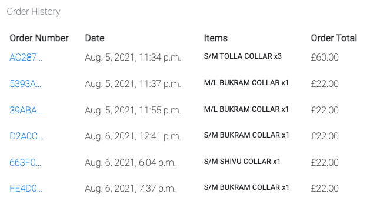

# Testing
## Contents

1. [Manual Testing](#manual-testing)
2. [DevTools](#devtools)
3. [Automated Testing](#automated-testing)
4. [User Stories](#user-stories)
5. [User Testing](#user-testing)

### Testing was done using the following browsers:

* Google Chrome
* Safari
* Firefox

### Devices used:

*Only Google Chrome and Safari were used for testing on the below devices*

* Iphone 7
* Ipad 3rd Generation 

# Manual Testing

## Navbar 

* Verify navbar button displays on all devices - ✅ 
* Verify animations functions on all devices - ✅ 
* Check all the navigation links direct to the appropriate pages - ✅ 
* Ensure my account links change once logged in - ✅ 
* Ensure "Product Management" link is only available for admin users - ✅ 
* Verify that the header is fixed on all devices -  ✅ 
* Verify the header items reorder for smaller devices - ✅ 

## Footer

* Verify the footer displays on all devices and is fixed to the bottom - ✅ 
* Verify the social icons display on all devices - ✅ 
* Check that all social links redirect to their respective urls - ✅ 

## Home

* Verify the page loads responsively on all devices - ✅ 
* Verify all the buttons link to their relevant pages - ✅ 
* Verify the testimonial carousel works on all devices - ✅ 
* Verify all relevant text is responsive - ✅ 
* Verify that only products with is_featured set to True are loaded in the featured section - ✅ 


## Products
* Verify the page loads responsively on all devices - ✅
* Verify the searchbox and sort boxes load - ✅
* Verify all products display for All Products link - ✅
* Verify only dog collars display for Dog Collars link - ✅
* Verify only dog leads displau for Dog Leads link - ✅
* Verify only waste bag dispensers display for Waste Bag Dispensers link - ✅
* Verify Searching by name - ✅
* Verify Searching by description - ❌ 


* Verify sorting by name - ✅

* Verify sorting by catergory - ✅
* Verify sorting by price - ✅
* Verify image navigation to product detail - ✅

## Product Detail
* Verify the page loads responsively on all devices - ✅
* Verify all the product images are preset - ✅
* Verify the Quantify and Size selectors work - ✅
* Verify the Keep Shopping and Add to Bag buttons work - ✅
* Verify the reviews for the item are displayed below - ✅
* Verify the average rating and amount of reviews display - ✅
* Verify the Edit, Delete buttons display for the admin user - ✅


* Verify the wishlist icon displays when a user is logged in (see above) - ✅
* Verify the item is added to the wishlist upon clicking the heart button - ✅
* Verify the info alert when an item is added to the wishlist - ✅


* Verify the item is removed from the wishlist if clicked again - ✅


* Verify item is added to bag when clicking the "Add To Bag" button - ✅


* Verify edit button navigated to edit product page - ✅
* Verify delete button activates model check - ✅


* Verify Review Item button activates model with form - ✅
* Verify edit and delete buttons only display on user specific review - ✅
* Verify edit button displays prefilled form in modal - ✅


## Profile
* Verify profile page loads responsively on all devices - ✅
* Verify Delivery information is show for registered user - ✅
* Verify Order History is populated with previous orders and all information is correct - ✅



* Verify delivery information updates when changed and saved - ✅
* Verify order number links to past order with notification - ✅

## Wishlist
* Verify Wishlist page loads responsively on all devices - ✅
* Verify product information is correct - ✅
* Verify Size and Quantity inputs work correctly - ✅
* Verify Trash Icon removes item from wishlist - ✅
* Verify Bag Icon adds item to shopping list - ✅
* Verify Clear Wishlist works as expected - ✅

## About
* Verify About page loads responsively on all devices - ✅
* Verify Images are displayed correctly - ✅
* Verify second row re-orders for smaller devices - ✅
* Verify both buttons at the bottom link to assigned urls - ✅

## Shopping Bag
* Verify Shopping Bag page loads responsively on all devices - ✅
* Verify Product images are displayed correctly - ✅
* Verify Product information is correct - ✅
* Verify all totals are adding correctly - ✅


* Verify items quantities can be updated - ✅
* Verify items can be removed - ✅
* Verify buttons navigate to appropriate urls - ✅

## Checkout
* Verify checkout page loads responsively on all devices - ✅
* Verify Delivery information and email are prefilled for active user - ✅
* Verify Order summary is correct and totals are calculated - ✅


* Verify Payment input works correctly - ✅
* Verify Payment input displays error message - ✅


* Verify Adjust Bag button redirect to bag - ✅
* Verify user directed to Checkout Success on completing order - ✅

## Checkout Success
* Verify Checkout Success page loads responsively - ✅
* Verify Order information is correct - ✅
* Verify Order Success message - ✅


* Verify Bag clears - ✅
* Verify Order is added to profile - ✅

## Transaction
* Verify payment success on Stripe - ✅


# Testing Errors

* Verify Searching by description - ❌


### This error was fixed by adding the below snippet to the all_products view. 
``` bash
| Q(description__icontains=query)
```
# Devtools

Chrome Devtools was used during the development process and used extensively for testing. All devices were checked for functionality and visual errors. It was also used to target certain elements of the site to check changes before adding them to the code.

The console was used to support the development process of the website JavaScript. Once completed the console was also checked for any errors on each page.

# Automated testing

* HTML was validated using [W3C HTML Markup Validation Service](https://validator.w3.org/)


* CSS was validated using [W3C CSS Markup Validation Service](https://jigsaw.w3.org/css-validator/)


* JS was validated using [jshint JS Markup Validation Service](https://jshint.com/)

[Back to top](#contents)

# User Stories

## User Story 1
### As a shopper I want to be able to view a list of products available, so that I can browse and select items to purchase.
* Upon arriving to the site there is a clear shop now button for the eager shoppers.
* There are also numerous links back to the product page, some with filters and there is also a main shop dropdown link in the navigation menu.
* The product page displays all products

## User Story 2
### As a shopper I want to be able to view individual product details, so that I can view extra images and product information.
* When a user clicks on an item they are taken to the product detail page
* The page has detailed information including extra images

## User Story 3
### As a shopper I want to be able to easily see featured items and promotions, so that I can take advantage of savings and newest products.
* Upon arriving at the site there is a clear banner at the top promoting a free delivery over £30.  This banner is part of the site header so stays visible
* When scrolling down the home page there is a section for featured items, almost like a mini shop where the user can click and view the details of each item. This is done with the is_featured field in the product model so these items can be changed by the admin.

## User Story 4
### As a shopper I want to be able to easily view the total of my shopping bag, so that I can avoid spending too much and stay within my budget.
* As soon as an item is added to the shopping bag the amount is updated below the bag icon.
* The bag icon is always visible on all devices as the header is fixed.

## User Story 5
### As a shopper I want to be able to see reviews and an average rating for each product, so that I can better judge my purchase based on product feedback.
* The average rating for a product is visible in the main products view and also the detail view.
* When in the detail view of a product there is an extra section below the product that has all the user reviews for that product.

## User Story 6
### As a site user I want to be able to easily register for an account, so that I can have a personal account and view my information.
* The user can click on the my account icon either in the navbar or the header providing 2 access points for new users to either access the login or registration pages.

## User Story 7
### As a site user I want to be able to easily login or logout, so that I can access my profile and wishlist information.
* The user has access to the login link through the my account dropdown menu.  As soon as they're logged in the links will change giving the user access to the logout link.

## User Story 8
### As a site user I want to be able to easily recover my password incase I forget it, so that I can recover access to my account.
* On the login page there is a clear "Forgotten Password?" link which takes the user to a page where they can enter their email address to recover their information.

## User Story 9
### As a site user I want to be able to receive an email confirmation after registering, so that I can verify my registration was a success.
* Once a user registers for an account a verify email is automatically sent.  This then just needs to be clicked which will register the user and redirect them to the site login page.

## User Story 10
### As a site user I want to be able to have a personalised user profile, so that I can view my order history and update my delivery and payment information.
* Once a user registers they get access to the "My Profile" link in the my account dropdown menu.  Once on the profile page the user can add or update delivery information and view order history.

## User Story 11
### As a registered user I want to be able to add my own review for a product, so that I can inform other users to the quality of the product.
* Once the user is logged in the "REVIEW ITEM" button becomes available on the product detail page where the user can add their review.
* This is done through a model and is rendered out within a box containing a title, description, username, rating and date posted.

## User Story 12
### As a registered user I want to be able to edit/update my review, so that I can correct any potential mistakes or a change of opinion.
* Once logged in the user gets 2 extra icons inside the box of the review they left. Users can only update their own reviews.
* Once clicking on the edit icon another prefilled model pops up allowing the user to make changes.

## User Story 13
### As a registered user I want to be able to delete my review, so that I can remove it from the site if I feel it's no longer relevant.
* Once logged in the user also gets access to a trash icon (next to the edit icon inside the review box).
* Once clicked it opens a model where the user has to confirm that they want to delete their view and also giving them the option to cancel if it was a mistake.

## User Story 14
### As a registered user I want to be able to add products to my wishlist, so that I can view them at a later date.
* Once registered a user can add a product to their wishlist via the detail view by clicking on the heart icon.
* Clicking the icon again removes the icon.  The icon works as a visual que for the user as to whether an item is already in their withlist or not.

## User Story 15
### As a registered user I want to be able to transfer items from my wishlist to my shopping bag, so that I can quickly purchase items I saved in my wishlist.
* Once the user navigates to their wishlist it has a shopping bag like display but with 2 extra icons.
* The bag Icon allows the user to place the item into their shopping bag.

## User Story 16
### As a registered user I want to be able to remove items from my wishlist, so that I can keep only the items I'm currently interested saved and remove other I'm no longer interested in.
* The user can remove items from their wishlist by either clicking on the heart icon for an existing product on the detail page or by navigating to the wishlist and clicking the trash icon next to the item they wish to remove.

## User Story 17
### As a registered user I want to be able to clear out my wishlist, so that I can quickly give myself a clean slate to add new items to instead of removing items individually.
* At the bottom of the wishlist page there are two buttons. The "Clear Wishlist" will empty the wishlist.

## User Story 18
### As a shopper I want to be able to sort the list of available products, so that I can easily find the products I want, by name, price or category.
* Within the products page there is small dropdown menu where the user can sort items based on name, price, A-Z / Z-A or category.

## User Story 19
### As a shopper I want to be able to sort a specific category of products, so that I can find the best priced products in a specific category or sort them by name.
* Once again the user can use the dropdown menu to sort items by category then price.

## User Story 20
### As a shopper I want to be able to search for a product by name or description, so that I can find a specific product I'd like to purchase.
* On the product page there is a search box directly under the page title which is clearly visbile.
* Users can enter keywords or a specific product name to filter products.

## User Story 21
### As a shopper I want to be able to easily see my search query and the number of results, so that I can quickly be able to decide if the product I want is available.
* When making a search the results are rendered on the page in the top left corner, showing the user's search query and how many products have been found.

## User Story 22
### As a shopper I want to be able to easily select the size and quantity of a product when purchasing, so that I can ensure I don't accidently select the wrong amount or size.
* When in the product detail view there are two input boxes where the user can select their desired size and quantity.

## User Story 23
### As a shopper I want to be able to view items in my bag to be purchased, so that I can identify the total cost of my purchase and all the items I will receive.
* The user can click on the bag icon at any time to view their current items and a subtotal.

## User Story 24
### As a shopper I want to be able to adjust the quantity of individual items in my bag, so that I can easily make changes to my purchase before checkout.
* On the bag page the user as another input field showing the current quantity of a specific item.
* This can be increased or decreased and then the update button will reload the new amounts and calculate the new totals.

## User Story 25
### As a shopper I want to be able to easily enter my payment information, so that I can checkout quickly with no hassles.
* On the checkout page there is a simple stripe card input field that works by using suggestions, so users can select any card they've previously used for an online purchase through stripe.

## User Story 26
### As a shopper I want to be able to feel my personal and payment information is safe and secure, so that I can confidently provide the needed information to make a purchase.
* The card information is handlded completely by stripe so there's no card data being saved within the app.

## User Story 27
### As a shopper I want to be able to view an order confirmation after checkout, so that I can verify that I haven't made any mistakes.
* Once a purchase has been made the user is redirected to a order confirmation page that has all the details for their purchase.

## User Story 28
### As a shopper I want to be able to receive an email after checkout with my order details, so that I can keep the confirmation of what i've purchased for my records.
* Once a purchase has been made the user is emailed a copy of their order summary for their records.

## User Story 29
### As a store owner I want to be able to add a product, so that I can add new products to my store.
* In the my account dropdown menu the admin user has access to "Product Mangement" which navigates to the add product page where a product can be added.

## User Story 30
### As a store owner I want to be able to edit and update a product, so that I can change product prices, descriptions, images etc.
* Once in the detail view of a product the edit button becomes available next to the product name.  The admin user can click this to navigate to a edit form containing current information and images. Filling in the form and replacing the images will update the item.

## User Story 31
### As a store owner I want to be able to delete a product, so that I can remove items that are no longer for sale.
* Once in the detail view of a product the delete button becomes available next to the product name.  If the admin user clicks the button a modal will appear requiring the user to confirm their choice as a safety net.

# User Testing

### My Mentor (Dick Vlaanderen)

On testing the site my mentor made suggestions to improve the contrast of the site.  This was done by swapping some white colour codes for black and vice versa to ensure the most readable choice was chosen.

My mentor also noticed the Edit Product template didn't have any thumbnail images which was then implemented after our last call on 04/08/21.